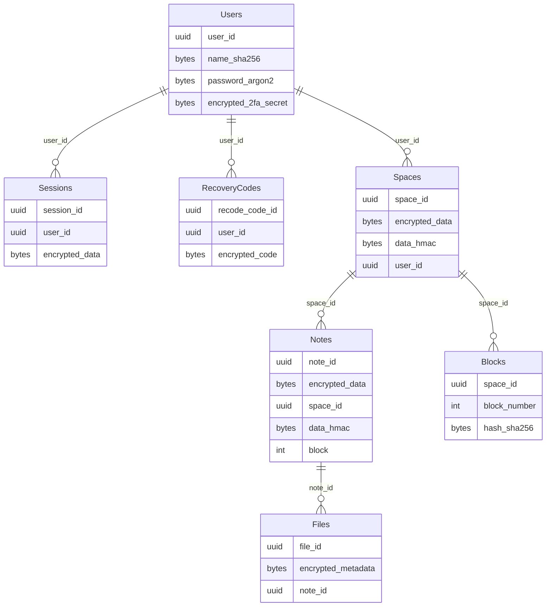

This document aimed to describe the server backup, synchronization functionality, users identity system. It contains high-level explanations, diagrams, motivation, reason, and purpose for all technical decisions.

> [!WARNING]
> It is an initial version of the document and the implementation hasn't started yet. The content may be changed in the future.
> All comments, feedback, questions, and proposals are highly welcome.

# Motivation

Currently (23.11.2024), all notes, spaces, files, and all other data are saved only on the user's computer without any synchronization between devices or even between client-server.

As a user, I want to be able to synchronize my data between devices and to have online backups on the web server. Moreover, it shouldn't block me from using the app offline.

# Goals

- To be able to sync data between server and client (local app).
- Multiple devices will sync the same data (data that belongs to the same user).
- Encryption of the data located on the server. All data on the server should be encrypted and the server should know nothing about the user's identity or user's data content.

# Design

## Data encryption

The web server serves as the user's data backup storage. It doesn't know about the data content or the user's identity. All data is encrypted using a strong encryption algorithm and the encryption key is known only to the user.

All security design is designed with the following statements in mind:

* Never trust any server.
* Trust the client's computer. So, the local DB is not encrypted and, theoretically, can be read by any app on the client's computer.

All data is encrypted using the [AES](https://en.wikipedia.org/wiki/Advanced_Encryption_Standard) [GCM](https://en.wikipedia.org/wiki/Galois/Counter_Mode) algorithm. The random AES block (16-byte) is prepended to the plaintext data to make the encryption non-deterministic (e.g. the same data encrypted with the same key will result in different cipher texts).
Additionally, the [HMAC](https://en.wikipedia.org/wiki/HMAC) SHA256 checksum is calculated over the plaintext data. HMAC is used to ensure data integrity.

The summarized encryption scheme looks like this:

```rust
// Pseudocode
fn encrypt(key: &[u8], plain_text: &[u8]) -> (Vec<u8>, Vec<u8>) {
    let confounder: [u8; AES_BLOCK_SIZE] = rand.gen();

    let plain_text = confounder + plain_text;

    let cipher_text = aes_gcm_256.encrypt(key, plain_text);
    let checksum = hmac_sha_256.hmac(key, plain_text);
    
    (cipher_text, checksum)
}
```

The same principle with data decryption but reversed:

```rust
// Pseudocode
fn decrypt(key: &[u8], cipher_text: &[u8], checksum: &[u8]) -> Vec<u8> {
    let plain_text = aes_gcm_256.decrypt(key, cipher_text);

    hmac_sha_256.verify(key, plain_text, checksum).expect("Data has been corrupted");

    // Remove the confounder block:
    plain_text[AES_BLOCK_SIZE..].to_vec()
}
```

The server does not and can not decrypt the user's data. Only the user (client) can do it because only the client can derive the encryption key.

## Key types and their derivation

The key derivation process consists of a few stages and needs two components: a secret key and a user's password.

### Secret key

The secret key is a piece of random bytes generated during the user's sign-up process. It is an additional security. Even if the password is compromised, the attacker will not be able to decrypt the data. The attacker needs a password and secret key to decrypt the cipher text.

If the user needs to add another device to their account, then it will need to type the secret key on the new device.

The secret key is stored in plain text on the computer. We trust the user's computer by design.

### Password

The password is created by the user during the sign-up process. The user is responsible for keeping the password safe. The app never stores the user's password (read more in the [auth](#auth) section).

### Key derivation

The encryption key derivation process is shown below:

```rust
// Pseudocode
fn derive_encryption_key(secret_key: &[u8], password: &[u8], user_id: &[u8]) -> Vec<u8> {
    let k1 = pbkdf2(password, user_id /* salt */, 650_000 /* number of iterations */);
    let k2 = hkdf(secret_key, user_id /* salt */, k1.len());

    xor(k1, k2);
}
```

### Relationship between entities in the server DB

All spaces ids, notes ids, etc are stored in plain text. There is no need to HMAC/encrypt IDs because all of them are randomly generated.

But, the user is 

So, if the attacker gets the server DB somehow, they will be able aware of the spaces <-> notes relationship (e.g. the attacker will know which notes belong to which spaces, but will not know the content itself), but they will not be able to match spaces + notes with users.

## Auth

### Sign-up

The user types the invitation token, password, and username during the sign-up process.

* `Invitation token`. The server has limited capacity and the app is no-profit. So, the number of users is also limited. You need to have an invitation token to sign up. You can obtain the token here: `todo!()`.
* `Username`. It can be any friendly name. The server doesn't share any data with anyone. Moreover, the server stores the hash of the username. The only reason why the user needs a username is to simplify the sign-in process on new devices.
* `Password`.

That's all. The server will create a new session and the sync process will begin right after the successful sign-up.

### Sign-in

You can install the app on any supported device and sign in. The sync process will begin right after the successful sign-in. To sign-in user needs to provide the following:

* `Username`.
* `Password`.
* [`Secret key`](#secret-key). This key is automatically generated during the sign-up process. The user can use the app on any other logged-in device to show the secret key.

> [!CAUTION]
> If the user loses their secret key (fs corruption, lost the laptop, etc), then they will not be able to decrypt the data. If you want, you can also put the secret key in your password manager alongside the password.

### 2FA

2FA is possible but optional. The only supported 2FA method is the Authenticator App. The user can ask the app to generate the QR code and recovery codes.

2FA secret and recovery codes are stored on the server side and encrypted using the server's encryption key.

2FA does not make the encryption of the data stronger. It makes the auth process stronger and better. In other words, the [secret key](#secret-key) is *a second factor* for data encryption like the authenticator app is the second factor for auth. The attacker with the password is unable to decrypt the data without a secret key and to sign-in without 2FA.

### The server encryption key rotation

The server encryption key rotation is not planned for the next few releases, but it's not a problem to implement it. The app design is flexible and it's not a big dial to implement the key rotation.

### User's identity on the server

Only the following user information is stored on the server:

* User id. All user ids are randomly generated and the server does not store any information about the user's real identity. So, there is no point in user id encryption.
* `Argon2` hash of the user password.
* `Sha256` hash of the user name.
* 2FA secret and recovery codes encrypted with the server's encryption key.

## Data synchronization

The client and the web server implement the data synchronization algorithm. Given two DBs: local one and server one. The goal is to synchronize the data between them. The difference can be of any size. For example, one of the devices can be offline for a long time. So, in such a case the difference may be huge.

### Data synchronization algorithm

The synchronization task can be represented (simplified) as follows: we have two sets of items (numbers, notes, spaces, files, any kind of items) and we need to find the difference and then merge them. Moreover, the amount of items can be large, so we don't want to waste a lot of time on delta calculation.

All items are divided into blocks. Or, in other words, every item has its `block_id`. The `block_id` is assigned during item creation and can not be changed in the future. Additionally, each item and each block has its hash. The item hash is calculated from encrypted item data, and the block hash is calculated from the concatenated block item hashes.


`h` - hash function. `i0..11` - items. `h(i0)` - `i0` item hashe. `b0..4` - blocks. `h(b0) = h(h(i0) | h(i1) | h(i2) | h(i3))` - `b0` block hash.

1. The client requests a list of blocks from the server when synchronization starts.
2. It compares the server's list of blocks with the local one and tracks blocks with different hashes. The client will have a list of different blocks as a result.
3. The client requests items hashes from the server that are in those found blocks.
4. It compares items hashes with local ones and tracks different ones. As a result, it will know what items were changed.
5. The client requests found items from the server and overrides the local ones. It always assumes that the server's data has a higher priority.

**_What if the server has some items that the client knows nothing about?_** They will be found in step 4. And instead of overwriting, they will be added to the local DB.

**_What if the client has some items that the server knows nothing about?_** Local items, that are not synched with the server, don't have a `block_id`. So, they don't appear in the synchronization process. Only the server can assign `block_id` to items during their creation on the server side.

**_What if some items were deleted from the server DB by another client?_** Then the client will find them in step 4 and erase them from the local DB too.

### How notes and spaces are stored

Here is an approximate scheme:



The server stores hash blocks only for notes, not for spaces. The user will most likely not have too many spaces to build hash blocks over.

### Synchronization options

This document implies the following possible synchronization options:

* **_Manual sync_**. The user manually synchronize the data between client and server by pressing the sync button.
* **_Push sync_**. The client keeps the socket connection open and the server will automatically send updates to the client device.

# Questions

> _Does the app need to have such a complex schema?_

Well, the server owner doesn't want to be responsible for the user's data. So, the less server knows the better.

> _Can I restore the data if the local DB was corrupted/erased?_

Only if you remember the `password` and the `secret key` or have another device logged in. In such a case, you can sign in again and all the data will be synchronized again. But you will lost the unsynchronized data.